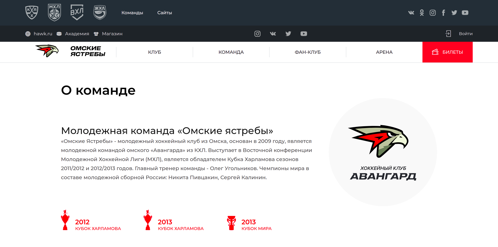

# Omsk Wings

## Description

The site of the hockey team "[Omsk Wings](https://omsk-wings.effective.band/)".

Here you can see information about the team, management, coaching staff, personnel. Information about the fanclub, arena and contacts is also provided.



Published at https://omsk-wings.effective.band/

<br/>

## Project tools

To work with the project, we used the following tools and technologies:

- VS Code
- Node
- Typescript ^4.0
- React ^17.0.1, Next
- MobX ^6.2.0
- SCSS
- Yarn
- ESLint ^7.2.0, Prettier 2.3.2, Husky 4
- Jenkins
- Git

<br/>

# Project architecture

The project uses `Next.js` for `SSR` (Server-Side Rendering), the backend is located separately.\
Asynchronous `axios` requests are made to the backend to the API endpoints.

> To use Server-side Rendering for a page, you need to `export` an `async` function called `getServerSideProps`. This function will be called by the server on every request.

https://nextjs.org/docs/basic-features/pages#server-side-rendering

<br/>

# Getting Started

## Installation

To install the project locally you need:

1. Clone this repository:

   ```
   git clone git@gitlab.com:studentlabs-ru/2021/omsk-wings/frontend.git
   ```

2. Go to the directory:

   ```
   cd frontend
   ```

3. Using the terminal, run

   ```
   yarn
   ```

   to install the dependencies.

<br/>

# Development

In the project directory, you can run:

```
yarn dev
```

Runs the app in the development mode.\
Open [http://localhost:3000](http://localhost:3000) to view it in the browser.

The page will reload if you make edits.\
You will also see any lint errors in the console.

<br/>

Build the app:

```
yarn build
```

Builds the app for production to the `.next` folder.

<br/>

To detect problematic patterns that do not comply with the rules and standards, we analyze the code using

```
yarn lint
```

by running this command, you check all your files, as a result, you get a detailed log with a description of the problem areas in each file, where errors will be found, which you can then manually run and fix.

<br/>

Automatic fixes:

The project is configured with `husky`, which triggers the execution of `yarn lint:fix` every time a commit is made.

```
yarn lint:fix
```

this command does about the same as the previous one. The only difference is that here yarn already has write permission - the command fixes errors by removing them from the code.

<br/>

Code optimization:

```
yarn prettier:fix
```

automatically formats and ensures consistent styling by parsing your code.

<br/>

# Deployment

The project is automatically deployed to production using `Jenkins` continuous integration. Fires when changes are pushed to main branch, or when other branches are merged into main branch.

In the `Jenkins` console you can see what commands it is executing:

```
rm -rf node_modules
yarn
yarn build
pm2 restart frontend-ssr
```

<br/>

# Roadmap

We would like to improve some points in the future. Such as:

- Remove duplicate code
- Fix map display on pages
- Observe a uniform layout style
- Refactor pages, make some blocks of code separate components

<br/>

# Contributing

Pull requests are welcome. For major changes, please open an issue first to discuss what you would like to change.

1. Fork the Project
2. Create your Feature Branch:

   ```
   git checkout -b feature/AmazingFeature
   ```

3. Commit your Changes:

   ```
   git commit -m 'Add some AmazingFeature'
   ```

4. Push to the Branch:

   ```
   git push origin feature/AmazingFeature
   ```

5. Open a Pull Request

<br/>

# License

[MIT](https://choosealicense.com/licenses/mit/)
